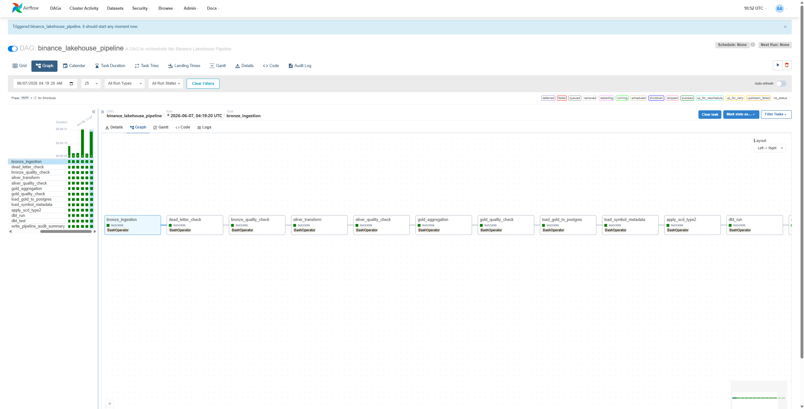
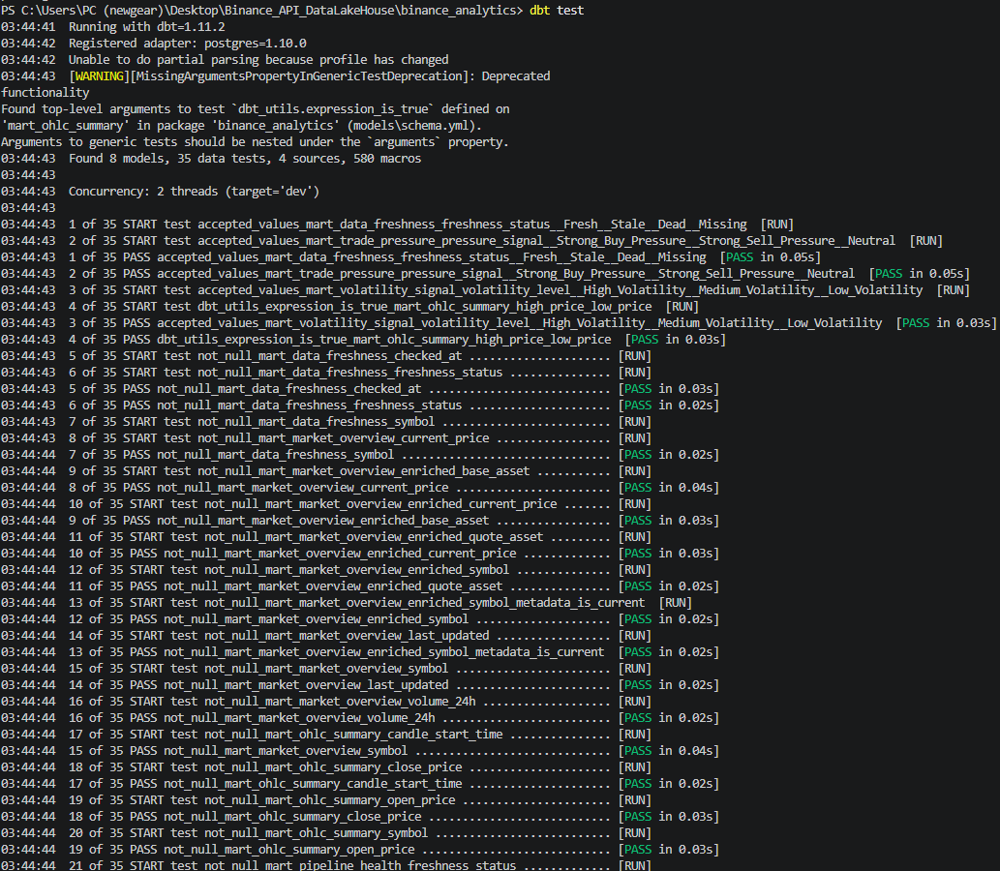
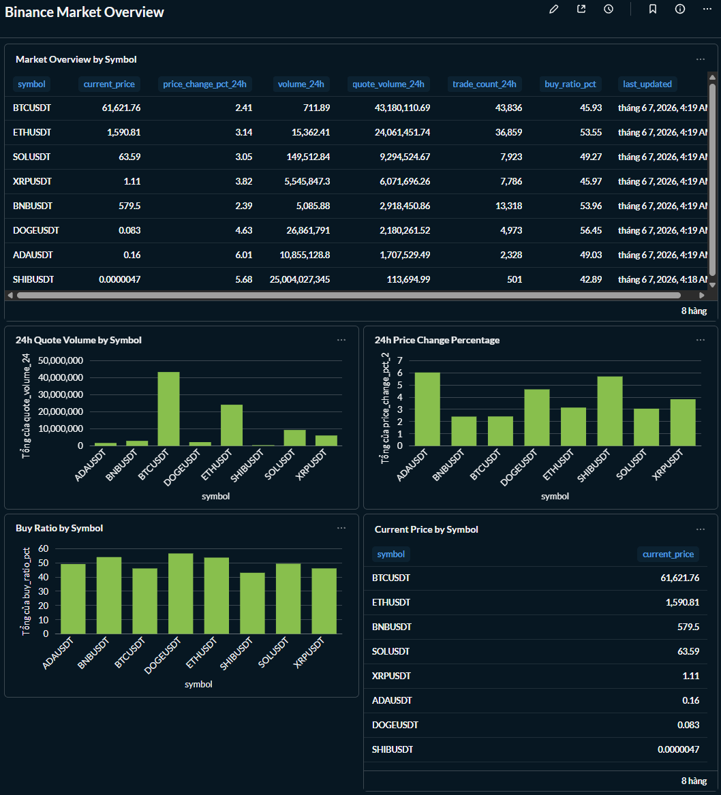
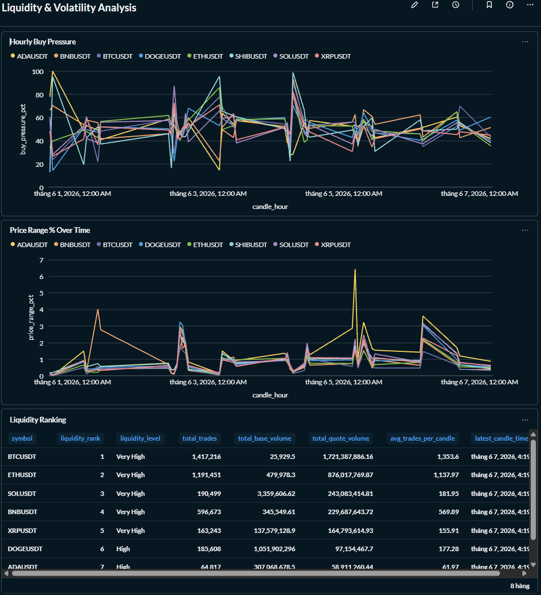
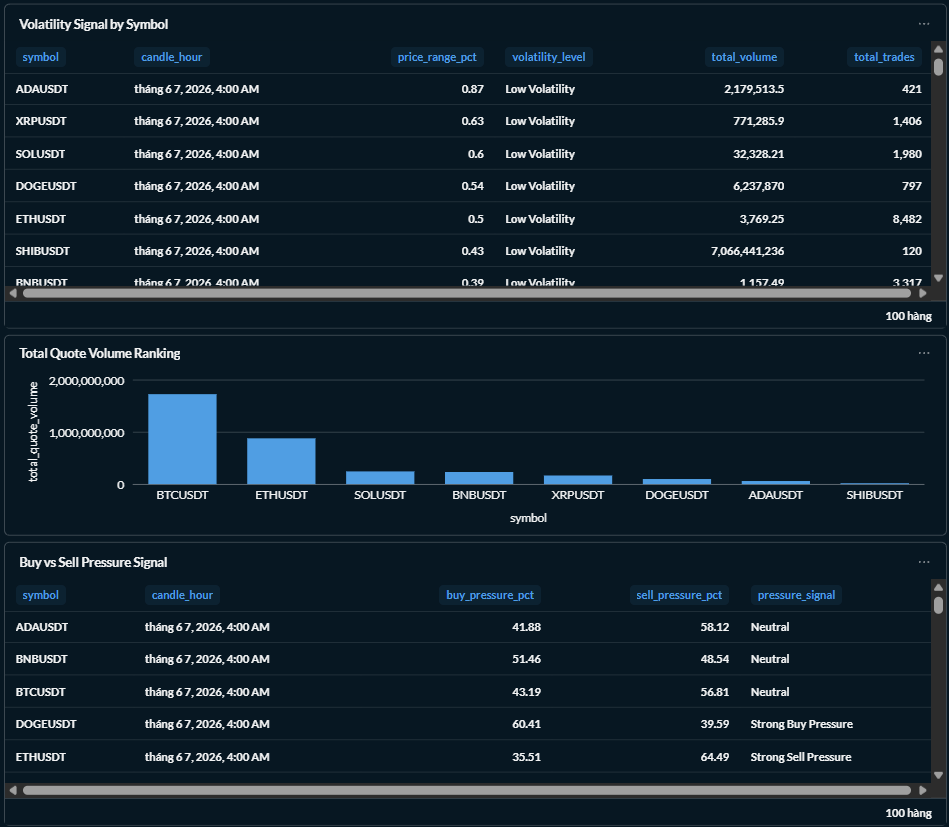
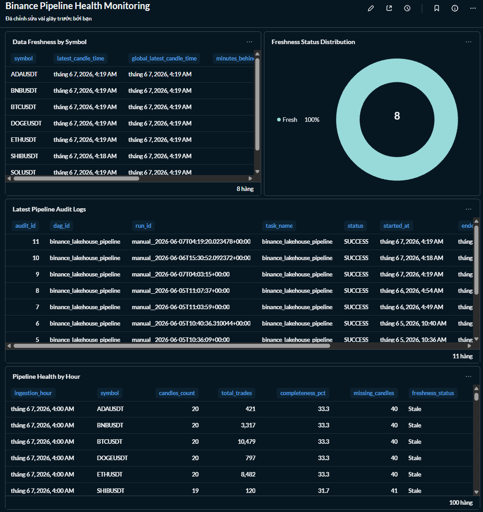

# 🪙 Binance Real-Time Data Lakehouse

A production-style local Data Engineering project that ingests live cryptocurrency trade data from Binance WebSocket API, streams it through Kafka, processes it with Apache Spark using a Medallion Architecture, stores data in MinIO and PostgreSQL, builds analytical marts with dbt, orchestrates the workflow with Apache Airflow, and visualizes business-ready insights in Metabase.

This project demonstrates practical Data Engineering skills including streaming ingestion, micro-batch processing, data lake design, warehouse modeling, idempotent loading, data quality gates, SCD Type 2, pipeline audit logging, data freshness monitoring, dbt testing, and BI dashboarding.

---

# 🎯 Problem Statement

Cryptocurrency trade data is generated continuously at high frequency and is difficult to analyze directly from raw streaming events. Raw Binance WebSocket messages are semi-structured, high-volume, and not suitable for business analysis without proper ingestion, validation, transformation, aggregation, and monitoring.

This project solves that problem by building a local production-style data lakehouse that transforms raw Binance trade events into analytics-ready market indicators and operational dashboards.

The final output is not only stored data, but a set of dbt analytical marts and Metabase dashboards that help users monitor:

- Market overview by trading symbol
- Current price, trading volume, and price change
- Liquidity ranking across crypto pairs
- Buy/sell trade pressure
- Volatility signals
- Data freshness and pipeline health

---

# Business Output

The final output of this project is a set of Metabase dashboards built on top of dbt analytical marts in PostgreSQL.

These dashboards turn high-volume raw trade events into actionable insights for both market monitoring and pipeline reliability.

### Market Analysis

The Market Overview dashboard helps users answer:

- Which trading symbols have the highest trading volume?
- Which symbols are increasing or decreasing in price?
- Which assets show stronger buy-side or sell-side activity?
- What is the latest market condition by symbol?

### Liquidity & Volatility Analysis

The Liquidity & Volatility dashboard helps users analyze:

- Which symbols have the strongest liquidity?
- Which symbols show abnormal volatility?
- How buy pressure and sell pressure change over time.
- Which symbols may require closer monitoring.

### Pipeline Monitoring

The Pipeline Health dashboard helps data engineers monitor:

- Whether the data is fresh or stale.
- Whether expected symbols are missing.
- Whether pipeline runs completed successfully.
- Whether data quality checks passed across Bronze, Silver, and Gold layers.

This makes the project a complete data product, not just a data pipeline.
---

# 📌 Project Metrics

|Metric|Value|
|---|---|
|Kafka retained trade events during local testing| 3.7M+ |
|PostgreSQL fact table rows| 3,600+ |
|dbt models| 8 |
|dbt data tests| 35 |
|Main Airflow DAG tasks| 12 |
|Metabase dashboards| 3 |
|Data lake layers| Bronze, Silver, Gold |
|Warehouse loading strategy| Staging + Upsert |
|Pipeline mode| Local micro-batch architecture |

These metrics are based on local development and testing runs. They may change depending on Kafka retention, pipeline frequency, and runtime duration.

---

## 🏗️ Architecture


```
Binance WebSocket API
    │
    V
Python Kafka Producer
    │
    V
Kafka Topic: crypto_trade_price_1
    │
    v
Spark Bronze Ingestion
    │
    V 
MinIO Bronze Layer
    |
    V
Spark Silver Transform
    |
    V
MinIO Silver Layer
    │
    V
Spark Gold Aggregation
    │
    V
MinIO Gold Layer
    │
    V
PostgreSQL Staging + Fact Tables
    │
    V
dbt Analytical Marts
    │
    V
Metabase Dashboards
```

### Architecture Style

This project follows a local micro-batch lakehouse architecture:

- The Binance producer runs continuously and streams trade events into Kafka.
- Airflow triggers the lakehouse pipeline in micro-batches.
- Spark processes accumulated Kafka data through Bronze, Silver, and Gold layers.
- PostgreSQL serves as the analytical warehouse.
- dbt builds business-ready marts.
- Metabase provides the final dashboard output.

---

## 🛠️ Tech Stack

| Layer | Technology |
|---|---|
|Data Source | Binance WebSocket API |
|Ingestion | Python Kafka Producer |
|Message Queue | Apache Kafka | 
|Processing	| Apache Spark / PySpark|
|Data Lake | MinIO |
|File Format | Parquet |
|Data Warehouse | PostgreSQL |
|Transformation	| dbt |
|Orchestration | Apache Airflow |
|BI / Dashboard | Metabase |
|Infrastructure | Docker, Docker Compose |
|Languages | Python, SQL, PowerShell |

---
# ⚙️ Engineering Highlights

- Implemented a Medallion Architecture using Bronze, Silver, and Gold layers on MinIO.
- Built a Kafka-based ingestion pipeline for Binance WebSocket trade events.
- Used Spark micro-batch processing to convert streaming data into Parquet lakehouse layers.
- Added data quality gates across Bronze, Silver, and Gold layers.
- Designed an idempotent PostgreSQL loading process using staging tables and ON CONFLICT DO UPDATE.
- Implemented SCD Type 2 for Binance symbol metadata.
- Built dbt marts for market overview, OHLC summary, liquidity, trade pressure, volatility, freshness, and pipeline health.
- Created Metabase dashboards as the final analytics output.
- Added Airflow orchestration and pipeline audit logging.
- Added data freshness monitoring to detect stale, missing, or delayed symbols.

# Airflow Orchestration
The main Airflow DAG orchestrates the full lakehouse workflow.

### Main DAG
binance_lakehouse_pipeline

Pipeline tasks:

bronze_ingestion
→ bronze_quality_check
→ silver_transform
→ silver_quality_check
→ gold_aggregation
→ gold_quality_check
→ load_gold_to_postgres
→ load_symbol_metadata
→ apply_scd_type2
→ dbt_run
→ dbt_test
→ write_pipeline_audit_summary

### Sentiment DAG

market_sentiment_daily

This DAG fetches Fear & Greed Index data and loads it into PostgreSQL for sentiment enrichment.

Fear & Greed API
→ Airflow Python Task
→ PostgreSQL fact_market_sentiment
→ dbt marts


# 🥉🥈🥇 Medaliion Architecture

## Bronze Layer

The Bronze layer stores raw and lightly parsed Binance trade events in MinIO as Parquet.

Main responsibilities:

- Read JSON trade events from Kafka.
- Preserve Kafka metadata such as topic, partition, offset, and timestamp.
- Preserve the raw message payload.
- Parse trade fields such as symbol, price, quantity, trade ID, and trade time.
- Partition data by year, month, day, and hour.
- Route invalid records into a dead-letter zone.

Example columns:

topic
partition
offset
kafka_timestamp
raw_value
symbol
trade_id
price
quantity
trade_time
trade_timestamp
year
month
day
hour

Storage path:

s3a://bronze/crypto_trades/

Dead-letter path:

s3a://bronze/dead_letter/crypto_trades/

---

## Silver Layer

The Silver layer cleans, validates, deduplicates, and enriches Bronze data.

Main responsibilities:

- Remove invalid records.
- Deduplicate trades by symbol and trade_id.
- Standardize numeric precision.
- Calculate trade value.
- Derive trade side.
- Detect large trades.
- Add processing timestamp.
- Partition data by year, month, day, and hour.

Example derived fields:

trade_value
trade_side
price_magnitude
is_large_trade
silver_processed_at

Storage path:

s3a://silver/crypto_trades/

---

## Gold Layer

The Gold layer aggregates Silver trades into analytics-ready OHLC market candles.

Main responsibilities:

- Aggregate trades into 1-minute candles.
- Calculate open, high, low, close prices.
- Calculate total volume and quote volume.
- Calculate buy/sell volume.
- Count trades and large trades.
- Produce market-level fact data for warehouse loading.

Example grain:

One row per symbol per candle_start_time

Storage path:

s3a://gold/market_candles/

---

# 🏦 PostgreSQL Data Warehouse

PostgreSQL is used as the serving warehouse for dbt and Metabase.

Main tables:

| Table | Purpose |
|---|---|
| stg_market_candles | Staging table for Gold data before upsert |
| fact_market_candles | Main OHLC market candle fact table |
| stg_symbol_metadata | Staging table for Binance symbol metadata |
| dim_symbol_scd | SCD Type 2 dimension for symbol metadata |
| fact_market_sentiment | Daily Fear & Greed Index data |
| pipeline_run_audit | Pipeline run audit log |

Primary fact grain:

One row per symbol per candle_start_time

Primary key:

(symbol, candle_start_time)

---

# 🔁 Idempotent Warehouse Loading

The project uses a staging table and PostgreSQL upsert logic to make warehouse loading safe for reruns and Airflow retries.

Flow:

Gold Parquet

→ PostgreSQL stg_market_candles
→ INSERT ... ON CONFLICT DO UPDATE
→ PostgreSQL fact_market_candles

This prevents duplicate fact records when the same Gold candles are loaded multiple times.

---

# 🧬 SCD Type 2

The project tracks Binance symbol metadata using SCD Type 2.

The dimension table preserves historical changes in symbol attributes instead of overwriting old records.

Tracked metadata includes:

Symbol

- Base asset
- Quote asset
- Status
- Price precision
- Quantity precision
- Tick size
- Step size
- Minimum quantity
- Record hash
- Valid from
- Valid to
- Is current

Table:

dim_symbol_scd

---

# ✅ Data Quality Gates

Data quality checks are executed across Bronze, Silver, and Gold layers before data is loaded into the warehouse.

Bronze Quality Checks

- Bronze data must not be empty.
- Symbol must not be null.
- Trade ID must not be null.
- Price must be greater than 0.
- Quantity must be greater than 0.
- Trade timestamp must not be null.
- Kafka metadata must exist.

Silver Quality Checks

- Silver data must not be empty.
- Price and quantity must be positive.
- Trade value must be positive.
- Duplicate symbol + trade_id records are rejected.
- Expected symbols are validated.
- Trade timestamp must not be null.

Gold Quality Checks

- Gold data must not be empty.
- high_price >= low_price.
- open_price > 0.
- close_price > 0.
- total_volume >= 0.
- trade_count > 0.
- Duplicate symbol + candle_start_time records are rejected.

If a quality gate fails, Airflow stops the pipeline before invalid data reaches PostgreSQL.

---

# 🧱 dbt Analytical Marts

dbt is used to build analytical marts and enforce data tests.

| Model | Purpose |
|---|---|
| mart_market_overview | Market overview by symbol |
| mart_market_overview_enriched | Market overview enriched with SCD symbol metadata |
| mart_ohlc_summary | OHLC candle summary |
| mart_symbol_liquidity |	Liquidity ranking |
| mart_trade_pressure | Buy/sell pressure analysis |
| mart_volatility_signal | Volatility classification |
| mart_data_freshness | Data freshness monitoring |
| mart_pipeline_health | Pipeline health monitoring |

Generate dbt documentation:

```
cd binance_analytics
dbt docs generate
dbt docs serve --port 8088
```

Open:

```
http://localhost:8088
```

---

# 📊 Dashboards

The final output of this project is a set of Metabase dashboards.

## 1. Binance Market Overview

This dashboard provides a high-level view of market activity by symbol.

It includes:

- Current price by symbol.
- 24h quote volume.
- Price change percentage.
- Buy ratio percentage.
- Market overview table.

Business questions answered:

- Which symbols are most actively traded?
- Which symbols have the strongest price movement?
- Which symbols show higher buy-side pressure?

## 2. Liquidity & Volatility Analysis

This dashboard analyzes liquidity ranking, quote volume, buy/sell pressure, and volatility signals across symbols.

It includes:

Liquidity ranking.
- Total quote volume ranking.
- Hourly buy pressure.
- Buy vs sell pressure signal.
- Volatility signal by symbol.
- Hourly price range percentage.

Business questions answered:

- Which symbols have the strongest liquidity?
- Which symbols are more volatile?
- Is buy pressure or sell pressure stronger?
- Which symbols may require closer monitoring?

## 3. Pipeline Health Monitoring

This dashboard monitors data freshness, pipeline health, audit logs, and failed/retried tasks.

It includes:

- Data freshness by symbol.
- Freshness status distribution.
- Pipeline health by hour.
- Latest pipeline audit logs.
- Failed or retried tasks.

Engineering questions answered:

- Is the data fresh or stale?
- Are any symbols missing?
- Did the pipeline complete successfully?
- Which task failed or retried recently?

---

# 🚀 Getting Started

Prerequisites

- Docker
- Docker Compose
- Git
- Python 3.10+
- Windows PowerShell or Linux shell

No Binance API key is required for public WebSocket trade streams.

---

### 1. Clone the repository

```
git clone https://github.com/LuanHai23/Binance_API_DataLakeHouse.git
```

```
cd Binance_API_DataLakeHouse
```

### 3. Configure environment variables

```
cp .env.example .env
```

Update values if needed:

KAFKA_BOOTSTRAP_SERVERS=kafka:29092
KAFKA_TOPIC=crypto_trade_price_1

```
MINIO_ENDPOINT=http://minio:9000
MINIO_ACCESS_KEY=minio_admin
MINIO_SECRET_KEY=minio_password

POSTGRES_HOST=postgres
POSTGRES_PORT=5432
POSTGRES_DB=warehouse_db
POSTGRES_USER=admin
POSTGRES_PASSWORD=adminpassword
```

### 3. Start all services

```
docker compose up -d
```

### 4. Access services

|Service | URL | Notes |
|---|---|---|
|Airflow | http://localhost:8081 | Pipeline orchestration|
|MinIO | http://localhost:9001 | Data lake storage|
|Metabase | http://localhost:3000 | BI dashboards|
|Spark UI | http://localhost:8080 | Spark cluster UI|
|PostgreSQL | localhost:5433 or container network postgres:5432 | Warehouse|

### 5. Run the pipeline

Trigger the main Airflow DAG:

binance_lakehouse_pipeline

Trigger the sentiment DAG:

market_sentiment_daily

Or run from PowerShell:

```
.\scripts\run_full_pipeline.ps1
.\scripts\run_sentiment_pipeline.ps1
```

### 6. Check warehouse data

docker exec -it de_postgres psql -U admin -d warehouse_db -c "SELECT COUNT(*), MIN(candle_start_time), MAX(candle_start_time) FROM public.fact_market_candles;"

### 7. Run dbt manually

```
cd binance_analytics
dbt run
dbt test
```

# 📁 Project Structure

```
Binance_API_DataLakeHouse/
├── dags/
│   ├── binance_lakehouse_pipeline_dag.py
│   └── sentiment_dag.py
├── kafka_producer/
│   └── producer.py
├── scripts/
│   ├── Medallion/
│   │   ├── spark_stream_bronze_ingestion_data.py
│   │   ├── spark_stream_silver_transform_data.py
│   │   ├── spark_stream_gold_aggregate_modeling_data.py
│   │   └── load_gold_to_postgres.py
│   ├── data_quality_check/
│   │   ├── quality_check_bronze.py
│   │   ├── quality_check_silver.py
│   │   └── quality_check_gold.py
│   ├── init_db/
│   │   ├── init_fact_market_candles.sql
│   │   ├── init_stg_market_candles.sql
│   │   ├── init_symbol_scd.sql
│   │   ├── init_fact_market_sentiment.sql
│   │   ├── init_pipeline_run_audit.sql
│   │   ├── apply_symbol_scd_type2.sql
│   │   └── upsert_fact_market_candles.sql
│   ├── audit_logger.py
│   ├── load_symbol_metadata.py
│   ├── run_full_pipeline.ps1
│   ├── run_sentiment_pipeline.ps1
│   ├── run_dbt_local.ps1
│   ├── start_services.ps1
│   └── stop_services.ps1
├── binance_analytics/
│   ├── models/
│   ├── macros/
│   ├── dbt_project.yml
│   ├── profiles.yml
│   └── packages.yml
├── images/
│   ├── architecture.png
│   ├── metabase_market_overview.png
│   ├── metabase_liquidity_volatility.png
│   ├── metabase_pipeline_health.png
│   ├── airflow_pipeline_success.png
│   ├── dbt_lineage.png
│   └── dbt_tests_success.png
├── docker-compose.yml
├── Dockerfile.airflow
├── Dockerfile.spark
├── Dockerfile.producer
├── dockerfile
├── .env.example
├── .gitignore
├── requirements.txt
└── README.md
```

📸 Screenshots
Airflow Pipeline Success




dbt Lineage


dbt Test Success




Metabase Market Overview



Metabase Liquidity & Volatility




Metabase Pipeline Health



---

# 🧠 Key Engineering Decisions

Why use Kafka?

Kafka acts as a buffer between the Binance producer and the Spark processing layer. This allows the ingestion layer and processing layer to be decoupled.

Why use Medallion Architecture?

The Bronze/Silver/Gold design separates raw data, cleaned data, and analytics-ready data. This makes the pipeline easier to debug, validate, and extend.

Why use micro-batch processing?

For this local project, micro-batch processing is more stable and easier to orchestrate than fully continuous streaming across all layers. The producer and Kafka run continuously, while Airflow triggers Spark jobs in batches.

Why use staging + upsert?

Direct append into the fact table can create duplicate records when Airflow retries or when the pipeline is rerun. The staging + upsert pattern makes the warehouse load idempotent.

Why use dbt?

dbt provides a clean transformation layer, model documentation, data tests, and lineage graph. It helps turn warehouse tables into business-ready analytical marts.

Why use Metabase?

Metabase provides the final business-facing output of the project. It allows users to explore market data, monitor liquidity and volatility, and track pipeline health through dashboards.

---

# ⚠️ Known Limitations

- This project is designed for local development and portfolio demonstration, not cloud production deployment.
- Kafka, Spark, MinIO, PostgreSQL, Airflow, and Metabase are deployed locally using Docker Compose.
- The pipeline uses micro-batch processing instead of fully continuous end-to-end streaming.
- No schema registry is implemented for Kafka message validation.
- No cloud object storage or managed orchestration service is used.
- Monitoring is implemented through Airflow logs, audit tables, dbt tests, and Metabase dashboards, not Prometheus/Grafana.
- Security hardening such as HTTPS, secret manager integration, and role-based access control is not implemented.

---

# 🔮 Future Improvements
- Deploy the pipeline on a cloud platform such as Azure or AWS.
- Replace local MinIO with cloud object storage.
- Add a schema registry for Kafka message validation.
- Add Prometheus and Grafana for infrastructure-level monitoring.
- Add Slack or Discord alerts for failed Airflow tasks.
- Add Great Expectations for declarative data quality checks.
- Add Apache Iceberg or Delta Lake for ACID table management.
- Add CI/CD checks for Python, dbt, and Docker.
- Add anomaly detection for abnormal volume, volatility, and price movement.

---

# ⚠️ Disclaimer

This project is for educational and portfolio purposes only. It is not financial advice and should not be used for real trading decisions.

---

# 🤝 Let's Connect

This project is a milestone in my journey toward becoming a Data Engineer. Building this end-to-end lakehouse helped me strengthen my skills in distributed processing, data orchestration, warehouse modeling, and analytical dashboarding.

I am currently open to Fresher Data Engineer and Data Engineer Intern opportunities.

LinkedIn: Hải Luân Nguyễn Ngọc
Email: nguyenngochailuan16112003@gmail.com

# 🌟 Explore More

If you liked this project, feel free to check out my other Data Engineering projects:

DataLens Lakehouse — Vietnam IT Job Market Data Lakehouse
