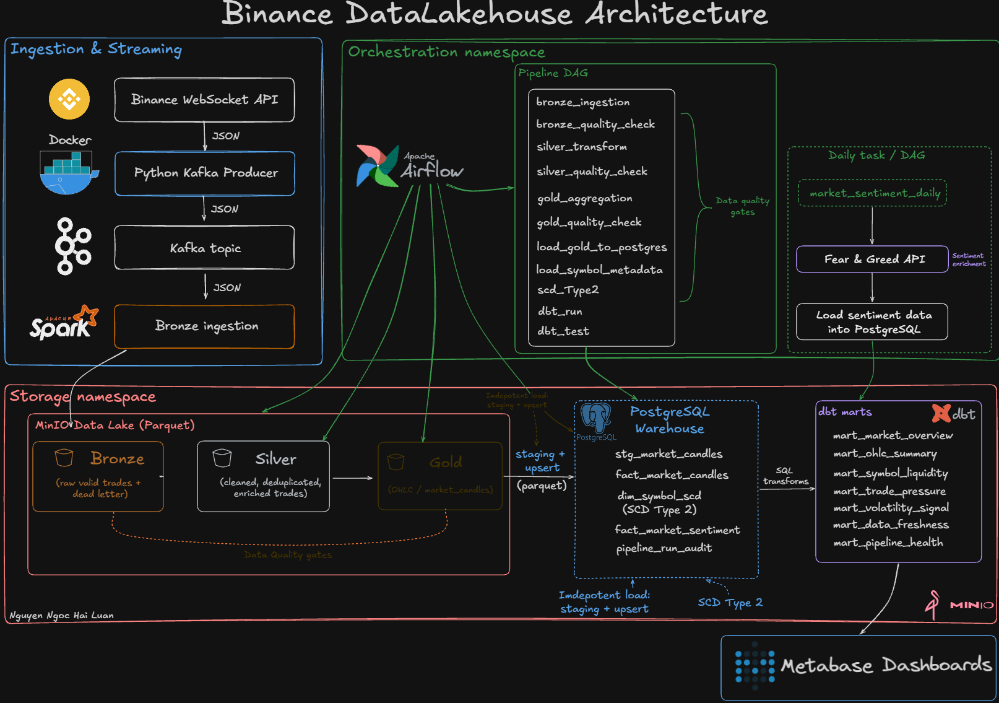

# 🪙 Binance Real-Time Data Lakehouse

A production-style local Data Engineering project that ingests live cryptocurrency trade data from Binance WebSocket API, streams it through Kafka, processes it with Apache Spark using a Medallion Architecture, stores data in MinIO and PostgreSQL, builds analytical marts with dbt, orchestrates the workflow with Apache Airflow, and visualizes business-ready insights in Metabase.

This project demonstrates practical Data Engineering skills including streaming ingestion, micro-batch processing, data lake design, warehouse modeling, idempotent loading, data quality gates, SCD Type 2, pipeline audit logging, data freshness monitoring, dbt testing, and BI dashboarding.

---

# 🎯 Problem Statement

Cryptocurrency trade data is generated continuously at high frequency and is difficult to analyze directly from raw streaming events. Raw Binance WebSocket messages are semi-structured, high-volume, and not suitable for business analysis without proper ingestion, validation, transformation, aggregation, and monitoring.

This project solves that problem by building a local production-style data lakehouse that transforms raw Binance trade events into analytics-ready market indicators and operational dashboards.

The final output is not only stored data, but a set of dbt analytical marts and Metabase dashboards that help users monitor:

- Market overview by trading symbol
- Current price, trading volume, and price change
- Liquidity ranking across crypto pairs
- Buy/sell trade pressure
- Volatility signals
- Data freshness and pipeline health

---

# Business Output

The final output of this project is a set of Metabase dashboards built on top of dbt analytical marts in PostgreSQL.

These dashboards turn high-volume raw trade events into actionable insights for both market monitoring and pipeline reliability.

### Market Analysis

The Market Overview dashboard helps users answer:

- Which trading symbols have the highest trading volume?
- Which symbols are increasing or decreasing in price?
- Which assets show stronger buy-side or sell-side activity?
- What is the latest market condition by symbol?

### Liquidity & Volatility Analysis

The Liquidity & Volatility dashboard helps users analyze:

- Which symbols have the strongest liquidity?
- Which symbols show abnormal volatility?
- How buy pressure and sell pressure change over time.
- Which symbols may require closer monitoring.

### Pipeline Monitoring

The Pipeline Health dashboard helps data engineers monitor:

- Whether the data is fresh or stale.
- Whether expected symbols are missing.
- Whether pipeline runs completed successfully.
- Whether data quality checks passed across Bronze, Silver, and Gold layers.

This makes the project a complete data product, not just a data pipeline.
---

# Project Metrics

| Metric | Value |
| Kafka retained trade events during local testing | 3.7M+ |
| PostgreSQL fact table rows| 3,600+ |
| dbt models| 8 |
| dbt data tests| 35 |
| Main Airflow DAG tasks| 12 |
| Metabase dashboards| 3 |
| Data lake layers| Bronze, Silver, Gold |
| Warehouse loading strategy| Staging + Upsert |
| Pipeline mode| Local micro-batch architecture |

These metrics are based on local development and testing runs. They may change depending on Kafka retention, pipeline frequency, and runtime duration.

---

## 🏗️ Architecture


```
Binance API
    │
    ▼
Kafka (Message Queue)
    │
    ▼
Spark Streaming
    ├── Bronze Layer  →  Raw trades (MinIO / S3)
    ├── Silver Layer  →  Cleaned & enriched (MinIO / S3)
    └── Gold Layer    →  OHLC Candles (PostgreSQL)
    │
    ▼
dbt (Data Marts)
    ├── mart_market_overview
    ├── mart_ohlc_summary
    └── mart_pipeline_health
    │
    ▼
Metabase (Dashboard)
```

# Project Metrics

Metric

**Orchestration:** Apache Airflow  
**Storage:** MinIO (Data Lake) + PostgreSQL (Data Warehouse)

---

## 🛠️ Tech Stack

| Layer | Technology |
|---|---|
| Ingestion | Python, Binance WebSocket API |
| Message Queue | Apache Kafka + Zookeeper |
| Processing | Apache Spark (PySpark) Structured Streaming |
| Storage | MinIO (Bronze/Silver), PostgreSQL (Gold) |
| Transformation | dbt (Data Build Tool) |
| Orchestration | Apache Airflow |
| Visualization | Metabase |
| Infrastructure | Docker, Docker Compose |

---

## 📊 Dashboards

### 1. Market Overview
- Current price, 24h price change %, High/Low per symbol
- Buy vs Sell volume ratio
- Total trades per symbol
  


### 2. OHLC Candlestick Summary
- Open / High / Low / Close per minute
- Bullish vs Bearish candle distribution
- Buy pressure % per hour heatmap
  


### 3. Pipeline Health Monitoring
- Data freshness status (Fresh ✅ / Stale ⚠️ / Dead ❌)
- Candle completeness % per hour
- Missing candles detection


---

## 🚀 Getting Started

### Prerequisites
- Docker & Docker Compose
- Binance API Key (free at binance.com)

### 1. Clone the repo
```bash
git clone https://github.com/your-username/Binance_API_DataLakeHouse.git
cd Binance_API_DataLakeHouse
```

### 2. Configure environment variables
```bash
cp .env.example .env
# Fill in your Binance API keys and MinIO credentials
```

### 3. Start all services
```bash
docker compose up -d
```

### 4. Access the services

| Service | URL | Credentials |
|---|---|---|
| Airflow | http://localhost:8081 | admin / admin |
| MinIO | http://localhost:9001 | see .env |
| Metabase | http://localhost:3000 | your setup |
| Spark UI | http://localhost:8080 | - |

### 5. Run the pipeline

1. Open Airflow at `http://localhost:8081`
2. Enable and trigger `medalion_dag` — runs Bronze → Silver → Gold
3. Enable and trigger `dbt_transform_daily` — builds data marts
4. Open Metabase to view dashboards

---

## 📁 Project Structure

```
├── dags/                        # Airflow DAGs
│   ├── medalion_dag.py          # Bronze → Silver → Gold pipeline
│   ├── dbt_dag.py               # dbt transformation
│   ├── hourly_batch_data.py     # Hourly batch ingestion
│   └── sentiment_dag.py        # Sentiment data pipeline
├── scripts/                     # Spark jobs
│   ├── spark_stream_bronze_ingestion_data.py
│   ├── spark_stream_silver_cleaning_data.py
│   └── spark_stream_gold_aggregate_modeling_data.py
├── binance_analytics/           # dbt project
│   ├── models/
│   │   ├── mart_market_overview.sql
│   │   ├── mart_ohlc_summary.sql
│   │   └── mart_pipeline_health.sql
│   └── dbt_project.yml
├── kafka_producer/              # Binance WebSocket producer
├── scripts/init.sql             # PostgreSQL schema initialization
├── Dockerfile                   # Airflow custom image
├── dockerfile.spark             # Spark custom image
├── docker-compose.yml
└── requirements.txt
```

---

## 🔄 Data Flow

### Bronze Layer
Raw trade data from Binance WebSocket API, stored as Parquet in MinIO.
```
{ symbol, price, quantity, trade_timestamp, is_buyer_maker }
```

### Silver Layer
Cleaned and partitioned by year/month/day/hour, stored in MinIO.

### Gold Layer
1-minute OHLC candles aggregated by Spark, written to PostgreSQL.
```
{ candle_start_time, symbol, open, high, low, close, volume, buy_volume, sell_volume, trade_count }
```

### Mart Layer (dbt)
Business-ready tables optimized for Metabase dashboards.

---

## ⚠️ Known Limitations

- dbt runs on batch schedule (not real-time streaming)
- Single Spark worker — not production-scale
- No HTTPS / authentication hardening (local dev only)

---

⚠️This project is for educational purposes only and is intended to showcase my skills on my CV.

## 🤝 Let's Connect!

This project is a significant milestone in my journey as a **Data Engineer**. Building this End-to-End Lakehouse from scratch has solidified my skills in distributed processing, data orchestration, and system architecture.

I am currently open to **Fresher Data Engineer** opportunities. If you find this project interesting, have any feedback, or want to discuss data architectures, I would love to connect with you!

* 💼 **LinkedIn:** [(https://www.linkedin.com/in/h%E1%BA%A3i-lu%C3%A2n-nguy%E1%BB%85n-ng%E1%BB%8Dc-67098531a/)]
* 📧 **Email:** [nguyenngochailuan16112003@gmail.com]

### 🌟 Explore More
If you liked this project, feel free to check out my other Data Engineering works on my profile:
* ⚡ **[DataLens_Lakehouse]** - Data Lakehouse: Vietnam IT Job Market.
