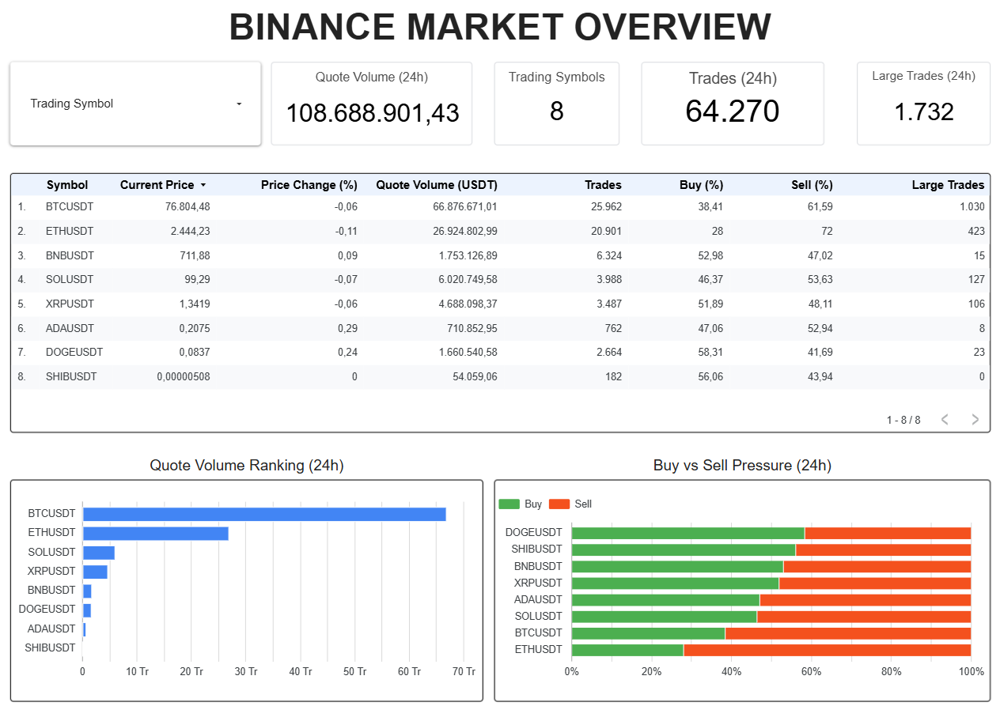

# Cloud BI Acceptance Evidence

Status: **Accepted**

The first cloud-native BI serving increment is deployed and validated end to end from the accepted BigQuery Gold candle fact through a business-facing analytical mart and interactive dashboard.

## Accepted scope

- Gold fact: `binance_gold_dev.fact_market_candles_1m`
- BI mart: `binance_gold_dev.mart_market_overview`
- Mart type: protected BigQuery logical view
- Infrastructure management: Terraform
- Visualization: Google Data Studio
- Dashboard: `Binance Market Overview — GCP Gold`
- Mart source commit: `58270a9`
- Dashboard image SHA256: `d452750f29ebe5b017631e8a1a82500ceafe515ba56fab70cf11fffdd9c6dc12`

The dashboard reads only the BI-facing mart. It does not connect directly to Silver data or reproduce transformation logic inside the visualization layer.

## Mart acceptance

The deployed view was verified against the reviewed SQL template and Terraform state.

| Gate | Accepted result |
|---|---:|
| Mart rows | 8 |
| Distinct trading symbols | 8 |
| Reconciled Gold candles | 440 |
| Reconciled trades | 64,270 |
| Reconciled large trades | 1,732 |
| Quote volume | 108,688,901.43 USDT |
| Invalid mart rows | 0 |
| Terraform convergence | No changes |

Accepted symbols:

`ADAUSDT, BNBUSDT, BTCUSDT, DOGEUSDT, ETHUSDT, SHIBUSDT, SOLUSDT, XRPUSDT`

The deployed view query matched the reviewed rendered SQL hash:

`01447867fd0bfa8631ca3abcceca4164640917fd49003eab233ce2159a844cfe`

## Dashboard acceptance

The dashboard provides:

- total quote volume, symbol count, trade count, and large-trade count;
- a symbol-level market overview table;
- quote-volume ranking by symbol;
- buy-side versus sell-side pressure;
- an interactive trading-symbol filter.

The unfiltered dashboard reconciled to the accepted mart totals.

## Interactive filter acceptance

The symbol filter was tested with `BTCUSDT`.

| Metric | Filtered result |
|---|---:|
| Trading symbols | 1 |
| Quote volume | 66,876,671.01 USDT |
| Trades | 25,962 |
| Large trades | 1,030 |
| Buy pressure | 38.41% |
| Sell pressure | 61.59% |

The scorecards, table, quote-volume chart, and buy/sell chart all reduced to the selected symbol, proving that the dashboard controls operate consistently across the report.

## Access and cost controls

- The interactive Google account successfully discovered and queried the protected BI view.
- No additional IAM grant was required for dashboard creation.
- Acceptance queries used Standard SQL and a 1 GB maximum-bytes-billed cap.
- The dashboard uses a pre-aggregated logical view instead of querying raw or Silver data.
- Public report sharing is outside this acceptance scope.
- The existing monthly billing guardrail remains active.

## Dashboard evidence

## Rolling-window correction (2026-09-12 UTC)

The live mart selects candle starts in `(W - 24 hours, W]`,
where `W` is the latest stored Gold candle start.
The former inclusive lower bound also selected candles exactly 24 hours old.

For `W = 2026-09-12 03:55:00 UTC`, the lower boundary
`2026-09-11 03:55:00 UTC` is now excluded.

| Mart metric | Before: inclusive lower bound | After: lower-exclusive |
| --- | ---: | ---: |
| Candle count | 446 | 438 |
| Trade count | 38,780 | 38,146 |
| Large-trade count | 748 | 744 |

Post-deployment acceptance returned 8 unique symbols.
Both full-row set differences and invalid-window counts were 0.
The earliest selected candle was `2026-09-12 03:00:00 UTC`.

Acceptance query: `job_rBkZdpzLfB32UhLVy_mrjjDbNBQN`.
Full-refresh Terraform convergence returned exit code 0: no changes.

The interval allows at most 1,440 aligned minute starts per symbol.
Missing candles are not filled. Metrics describe collected trades, not
continuous Binance market coverage; the latest stored price is not a
real-time quote.

Only the logical view definition changed. Historical Gold data, Workflow,
IAM, and Scheduler configuration were unchanged.
Earlier metrics and the original dashboard image remain historical snapshots.

## Acceptance declaration

The first cloud-native BI serving path is accepted:

`Scheduled ingestion -> Silver -> native BigQuery Gold -> BI mart -> interactive dashboard`

The implementation demonstrates an end-to-end managed data product while keeping the BI scope intentionally small: one governed mart, one dashboard page, and no additional orchestration or serving infrastructure.
