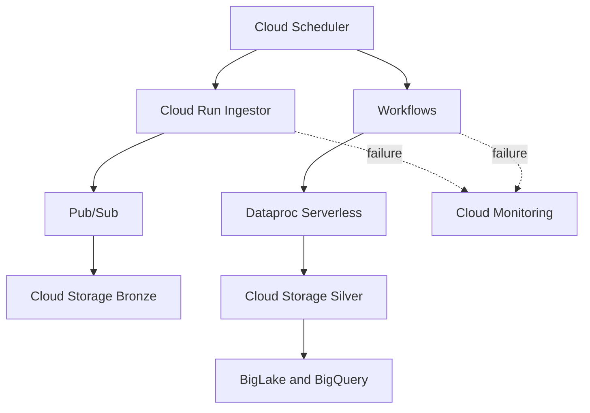

# Deployed GCP MVP

Status: **Accepted and operating automatically**

This is the deployed GCP Bronze-to-Silver data pipeline for Binance aggTrade events. Terraform manages the infrastructure, and the development pipeline runs once daily to limit cost.

## Architecture

## Automatic schedule

| Stage | UTC | Vietnam | Purpose |
|---|---:|---:|---|
| Ingestor | 03:00 | 10:00 | Collect a bounded 55-minute window |
| Silver | 04:10 | 11:10 | Process the preceding Bronze hour |

Both Scheduler jobs use `Etc/UTC` and are enabled through Terraform.

## Data layout

- Bronze: `gs://<project>-bronze/raw/aggtrade/YYYY/MM/DD/HH/*.jsonl`
- Silver: `gs://<project>-silver/aggtrade/source_batch=<batch>/event_date=<date>/symbol=<symbol>/*.parquet`
- Catalog: `binance_silver_dev.aggtrade`
- Hive keys: `source_batch`, `event_date`, and `symbol`

## Production controls

- Dedicated workload service accounts and restricted IAM
- Terraform-managed infrastructure with deletion protection
- Required BigLake partition filters
- ERROR-severity pipeline alerts with email notification
- Monthly VND 500,000 alert-only billing guardrail
- Zero-retry bounded Ingestor execution
- Daily scheduling to control development cost

## Acceptance result

The first unattended cycle passed on 2026-09-09:

- Bronze delivery: passed
- Workflow and Dataproc transformation: passed
- Input and Silver output: 50,917 rows
- Unique event IDs: 50,917
- Rejected, duplicate, and quarantine rows: 0
- Symbol partitions: 8
- Terraform convergence: no changes

See [Operations runbook](OPERATIONS_RUNBOOK.md) and [Acceptance evidence](ACCEPTANCE_EVIDENCE.md).

## Next phases

Cloud Gold models, BI dashboards, controlled backfill, and advanced CI/CD are planned enhancements beyond this accepted MVP.
